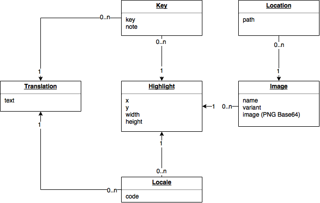
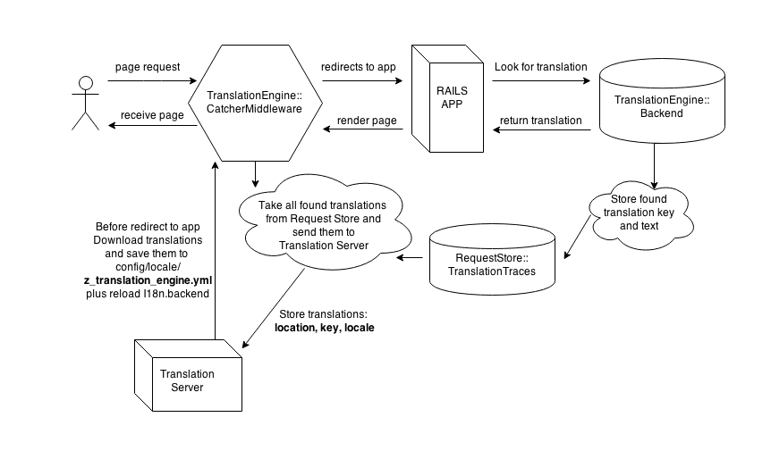
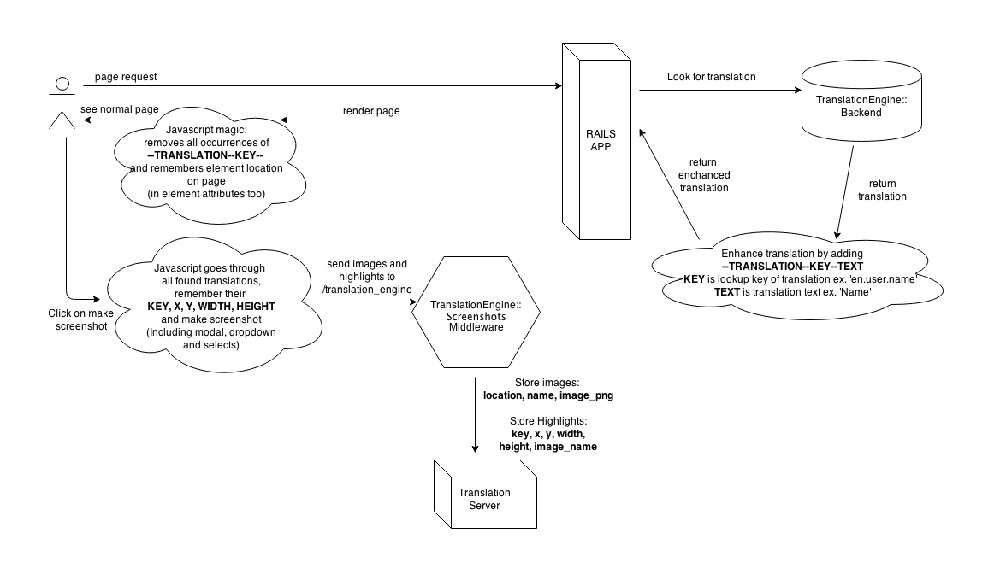

# Translation server 

Stores translations with location and screenshot.
Enable users to easily edit translations and then any rails application can
use them.

* To start application use `bundle exec rails s`
* To start react application for development `gulp watch`
* React application is on `/app` route

## Architecture of service

Data model of Translation server

Catcher is middleware in rails APP which catches all used translations in page
and then it sends them into Translation Server.

Screenshots middleware takes highlights and images which sends into Translation
Server.

# Developer

Use the following guides for getting things done, programming well, and
programming in style.

* [Protocol](http://github.com/thoughtbot/guides/blob/master/protocol)
* [Best Practices](http://github.com/thoughtbot/guides/blob/master/best-practices)
* [Style](http://github.com/thoughtbot/guides/blob/master/style)

# Clear database (without users)

`rake clear_database`

# Key Libraries used

* [Interfacer](https://github.com/zepod/interfacer) - REST API client
* [Reselect](https://github.com/reactjs/reselect) - `State => Props` helper with memoization
* [Normalizr](https://github.com/paularmstrong/normalizr) - Normalizes fetched data for store
* [Draft](https://github.com/facebook/draft-js) - Rich html editor
* [Flow](https://github.com/facebook/flow) - Static Type checker

# JavaScript dev tools

* `yarn eslint`: check code style rules
* `yarn eslint -- --fix`: automatically fix eslint problems
* `yarn ava`: run AVA tests one time
* `yarn ava -- --watch`: runs AVA tests and watch for changes
* `yarn jest`: run Jest tests one time
* `yarn jest -- --watch`: run Jest tests and watch for changes
* `yarn test`: run `eslint`, `Jest` & `AVA`
